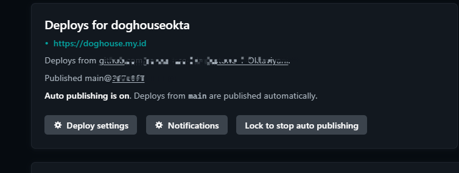

Hello My name is **Okta**
This is the assignment for milestones 1
please support my works

| Platform     | Username          |
| -----------  | -----------       |
| Email        | <katuniakz@gmail.com>       |

# Cat & Dog Academy Website

This is the repository for the Cat & Dog Academy website, a comprehensive platform for pet owners to learn about the academy's services and facilities. The website is designed to provide an engaging and informative experience for users, showcasing the academy's commitment to providing a nurturing environment for cats and dogs.

## Features

* Introduction to the academy and its mission
* Overview of the facilities, including indoor and outdoor training areas, state-of-the-art equipment, comfortable living quarters, and on-site veterinary care
* Showcase of the professional handler facility, including secure premises, ample parking, and experienced staff
* Display of various activities offered, such as basic obedience training and agility training

## Technologies Used

* HTML5 for structuring content
* CSS3 for styling and layout
* JavaScript for dynamic interactions and functionality

## Contributing

Contributions are welcome! If you'd like to contribute to the project, please fork the repository, make your changes, and submit a pull request.

## License

This project for revou milestones 1

# you can visit the website in https://doghouse.my.id/ with new look, am i getting better?

## How to deploy from scratch to website

**how to do of my homework**
here

**1. Registering to Netlify**

Visit the Netlify Website: Go to Netlify's official website.

Click on "Sign Up": On the homepage, locate the "Sign Up" button. It's usually at the top right corner of the page.

Sign Up with Email or Git Provider: I choose Github for this time

Email: Enter your email address, create a password, and click "Sign Up".
Git Provider: You can also sign up using your GitHub, GitLab, or Bitbucket account. Click on the respective button (GitHub, GitLab, or Bitbucket) and authorize Netlify to access your account.
Verify Your Email (if applicable): If you signed up using your email address, you may need to verify your email. Netlify will send you a verification link to the email address you provided. Click on the link to verify your account.

Complete the Registration: After verification (if required), you'll be redirected to your Netlify dashboard. Here, you can start exploring the various features Netlify offers, such as deploying new sites, managing domains, setting up continuous deployment, and more.

Explore Netlify Features: Take some time to navigate through your dashboard and explore the settings and options available. Netlify provides powerful features like automatic deployments, form handling, serverless functions, and more, which can enhance your web development and deployment process.

since my register is not smooth as above, i'll explain some of my problem register

**how to handle this?**
i suggest you to contat support to fix the problem and send some of the proving document by email. Netlify team will help you to fix it. Dont worry, we just need to wait at least 24 hours, but sometimes less. so after that try to login again.

Voila!!

Your netlify ready to use, since its connect to my github, we can deploy the with netlify and first step is open the netlify and start to make project or importing it from github
check the picture below

Import from other site

choose from github

the authorized pop up will show, then wait!

after its done, your site has been deploy

easy and cheesyy (enjoy your new website in netlify)

**2. Connect custom domain from netlify using DNS setup**

Now we need some upgrade of the website using custom domain, so i've paid a custom domain with doghouse.my.id after that i need to connect it to my source in netlify

First step. 
open Domain in netlify menu, add new register domain, then input the doghouse.my.id, check picture below

fill your website name

now the domain name its in your netlify, but wait you have to setup the DNS, here how to do it

edit your DNS record in netlify same with DNS in your domain system web

after that Netlify will suggest you to edit your DNS name server

copy the greenbox to the DNS name server in the domain system

Now save, and it will takes time to connect. Just wait patiently, its said 24 hour. But in my case just 1 hours.

## Changing my Repo from old repo to the new Repo

### Open deploy in netlify

click deploy setting

manage your repository

and link to different repo...
then follow the step....

Voila,, its finish
your website its a new fresh!!

#visit mine at  https://doghouse.my.id/
